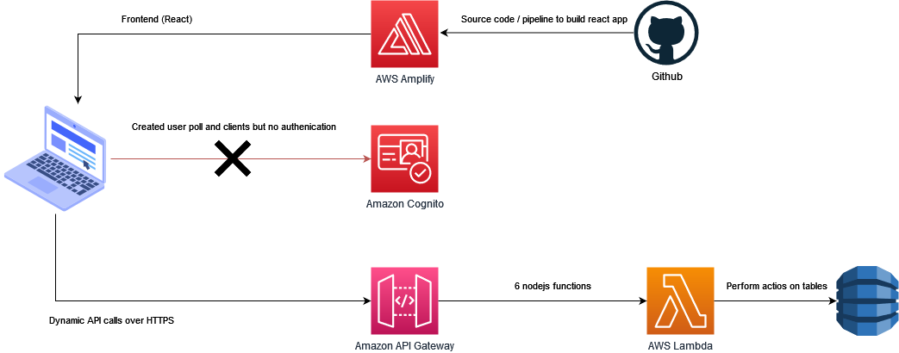

# Readme
Infrastructure as Code (IaC) solution using Terraform to provision and manage resources on Amazon Web Services (AWS) cloud services.
# How to run 
1. Initialize Terraform `terraform init`
2. Review the configuration and verify the resources `terraform plan`
3. Apply the Terraform configuration `terraform apply`
4. Add secret key and tokens.
# AWS architecture diagram

List of AWS services:
- [x] AWS Lambda
- [x] Amazon API Gateway
- [x] AWS Amplify
- [x] Amazon DynamoDB
- [ ] Amazon Cognito
# Frontend
Link to frontend forked source code [React boilerplate app](https://github.com/karolrav/React-front)
Deployed from repository.
# Backend
Backend consists of 6 lambda nodejs functions integrated with api gateway.

* get-all-authors to return all the users in the database
* get-all-courses to return all the courses in the database
* get-course to return only one course
* save-course to create a new course
* update-course to update a course
* delete-course to delete a course

  
# Database
Application uses amazon DynamoDB as nosql database with 2 tables: 
* Authors
* Courses

# Data Storage and Retrieval:
By using AWS DynamoDB or another suitable AWS database service, you can store and retrieve data efficiently. DynamoDB is a fully managed NoSQL database service provided by AWS, which can handle high throughput and scale automatically.

# Scalability: 
The architecture you mentioned can be designed to be highly scalable. AWS Lambda, which is a serverless compute service, allows you to run your code in response to events and automatically scales to handle increasing traffic and user demand. DynamoDB, being a managed service, can also scale horizontally to accommodate higher throughput and storage needs.

# High Availability:
The architecture can be designed to be highly available. AWS Lambda, API Gateway, and Amplify are managed services provided by AWS, ensuring high availability and reliability. DynamoDB also provides built-in replication and automatic multi-Availability Zone (AZ) failover, which helps minimize downtime and ensures data availability.

# Security: 
AWS services such as Amazon Cognito, when integrated into the architecture, can provide user authentication, authorization, and user management capabilities, helping to protect user data. Additionally, AWS provides various security features and best practices to secure the infrastructure and data, such as network isolation, encryption options, and identity and access management controls.

# TODO
- [ ] Add Amazon Cognito to incorporate authentication and authorization , as resources are created but need to be implemented from Reactjs ( registration page / login page / token for usage)
- [ ] Clean code on terrafrom IAAC most of resources can be reusable or passed for loop. Also move to folders for better visibility.
- [ ] Add additional variables to configure scalability, high availability and security easier.

